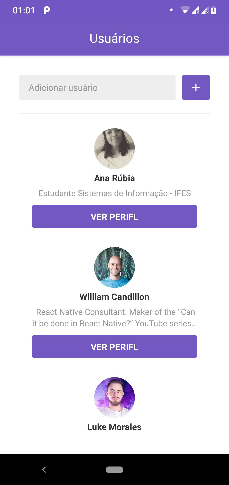

<h1 align=center>
   Course-GoStack-9
</h1>
<h1 align="center">
    
</h1>

### Aplicação Mobile usando React-Native 

- Semana 2 do BootCamp Go Stack 9

 > Keep coding, stop to drink coffee :coffee:, then, back to coding.  

Mas se quiser decolar de vez, tem que seguir a lista de tarefas:

- [x] :two: Modulo 6
- [ ] :ok_hand: Tarefa modulo 6

---

#### Aplicação que busca de Usuários do Github e lista na tela.

  
  <h2 align="center">  </h2>

